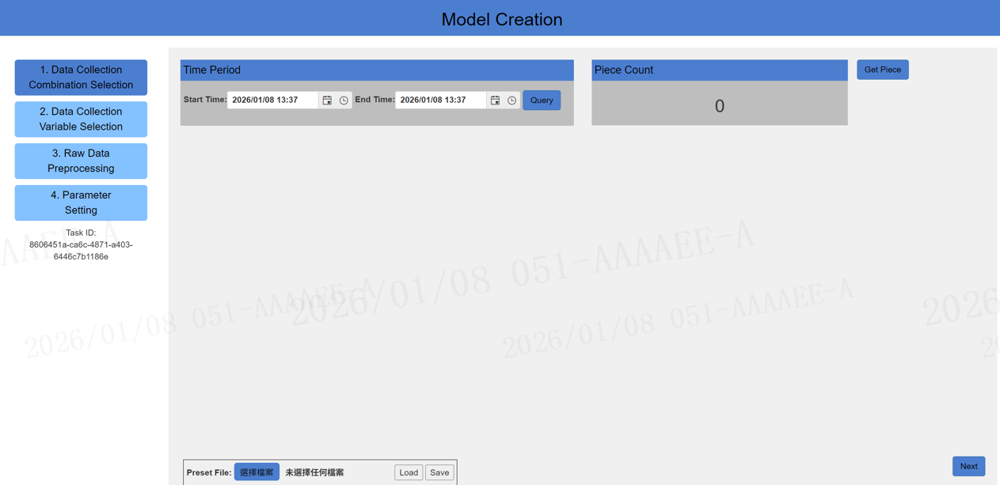
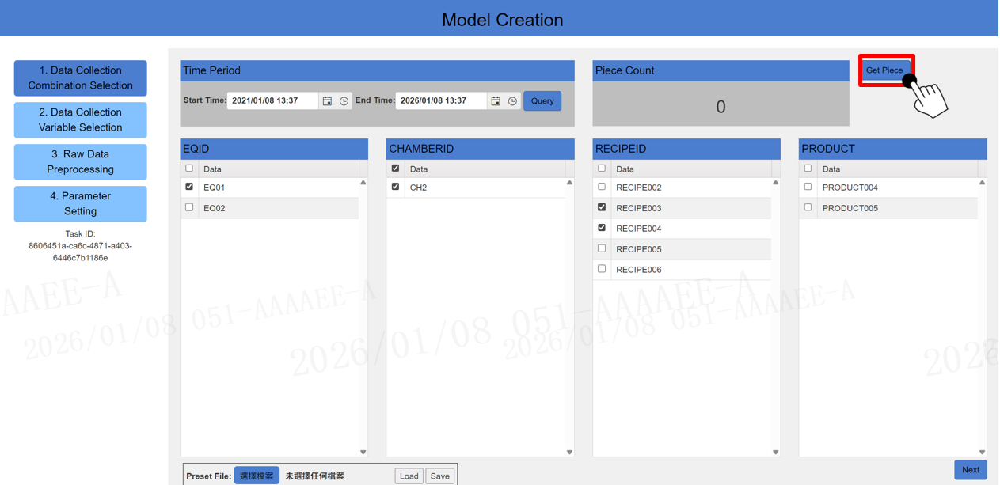
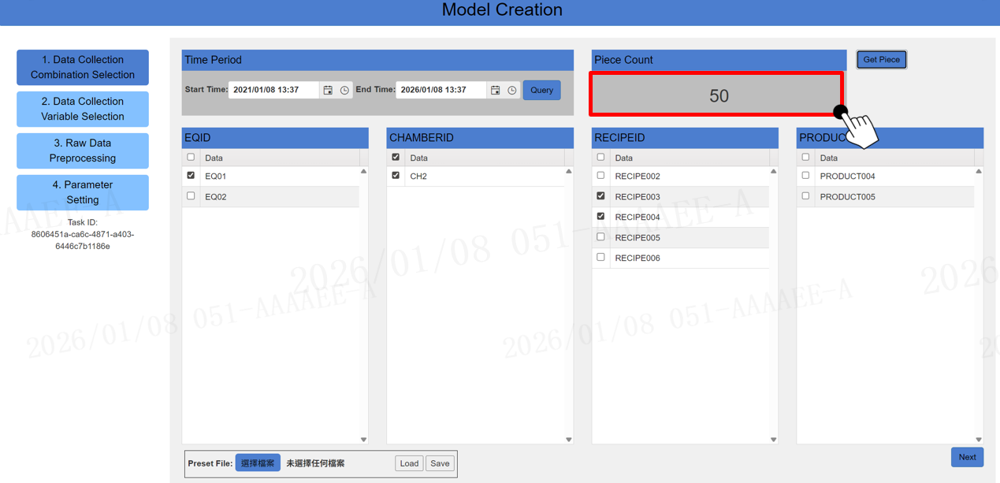
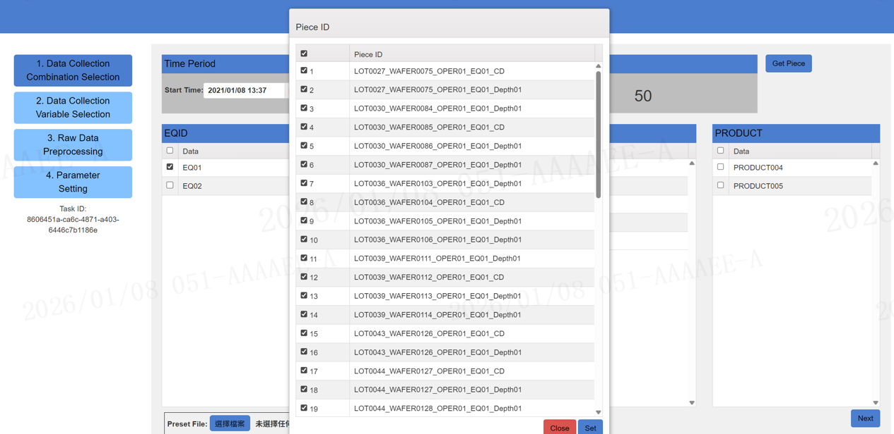
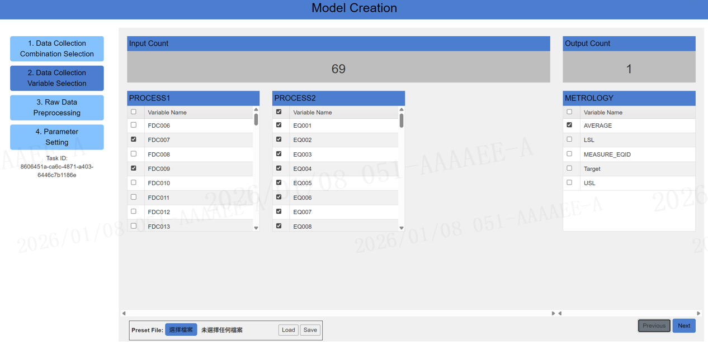
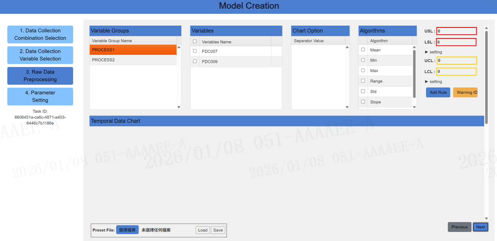
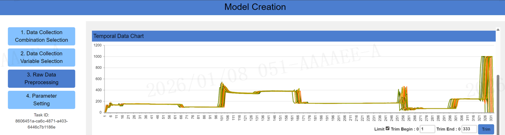
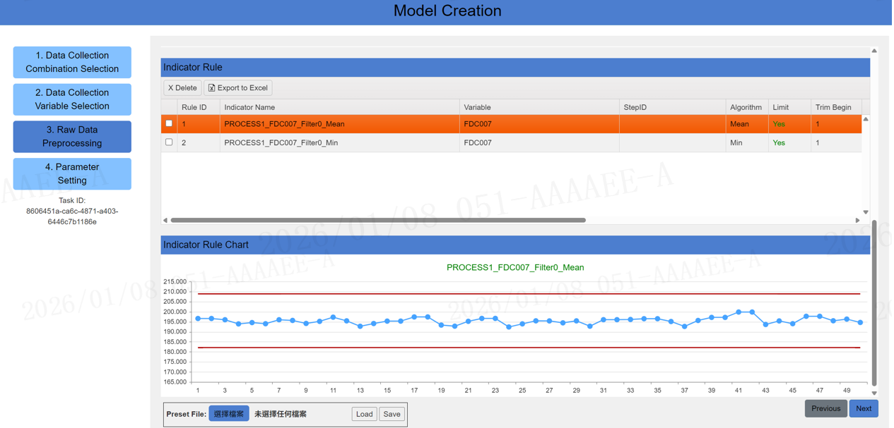
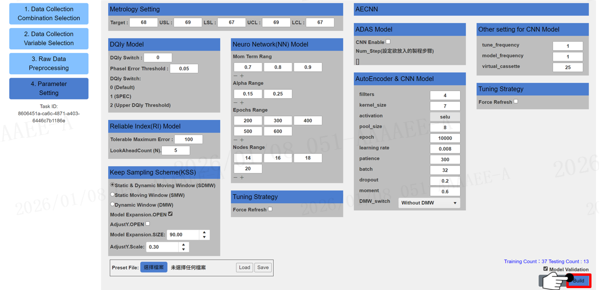

# MCC User Guide

Enter the MCC system URL in the address bar and open the MCC website to access the main page.

---

## Data Collection

Select production history conditions within a time range for modeling, and click Get Piece to retrieve the number of data records for modeling.

 
Click Piece Count to display the Piece ID list, where you can select or exclude Piece IDs. Finally, click Next to proceed to the data parameter filtering step.

---

## Data Parameter Filtering

Select important production parameters and measurement types to include in the modeling model. After selection, click Next to proceed to the data preprocessing step.

---

## Data Preprocessing

Set specifications for each important parameter and configure upper and lower limits (USL, LSL, UCL, LCL) through algorithms.

Display data for a single important parameter.

Display trend chart for a single important parameter.

---

## Algorithm Parameter Configuration

Algorithm parameter terminology explanation

| System | Term | Description |
|------|------|------|
| **Metrology Setting** | Target | Specification target |
| | USL | Upper specification limit |
| | LSL | Lower specification limit |
| | UCL | Upper control limit |
| | LCL | Lower control limit |
| **DOIk Model** | PhaseI Error Threshold | Maximum allowable error threshold between actual measurement and predicted values |
| **Neuro Network(NN) Model** | Mom Term Range | Momentum term Direction of steepest descent of instantaneous error plus a proportion of the previous iteration adjustment value. Learning rate of the inertia factor; larger values result in slower learning rates. |
| | Alpha Range | Learning rate Smaller values: slower convergence process but relatively higher iteration count; Larger values: accelerate search efficiency but may cause unstable oscillations in the objective function during the search process. |
| | Epochs Range | Iteration count limit Larger values result in more iterations (loops) |
| | Nodes Range | Number of neurons |
| **Reliable Index(RI) Model** | Tolerable Maximum Error | Maximum allowable error threshold for NN and PLS predicted values |

After configuration is complete, click Build to create the model

