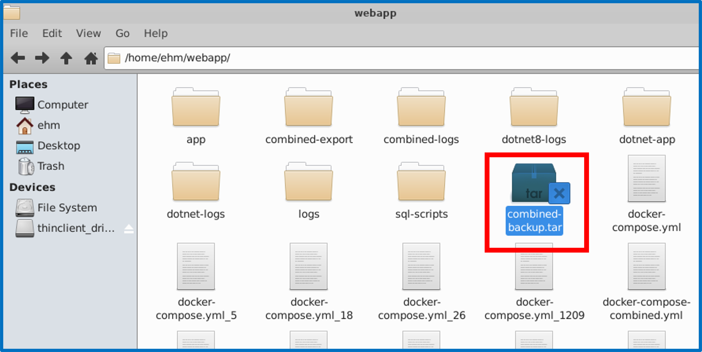
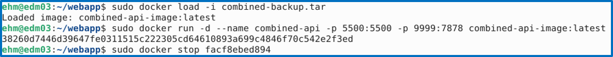
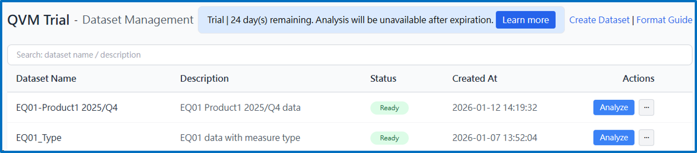
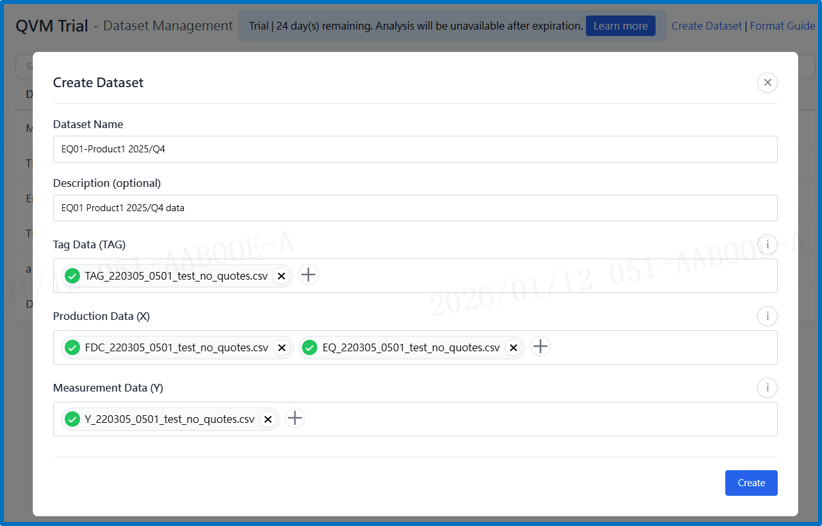
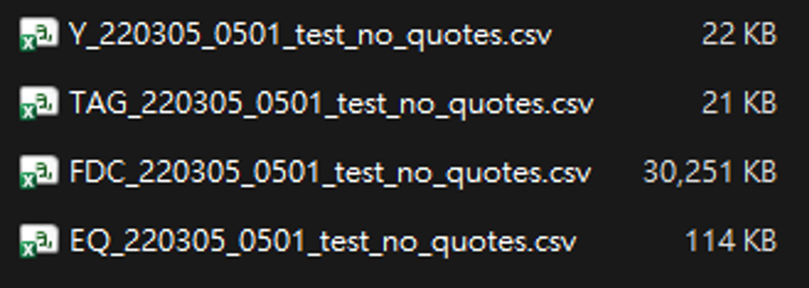
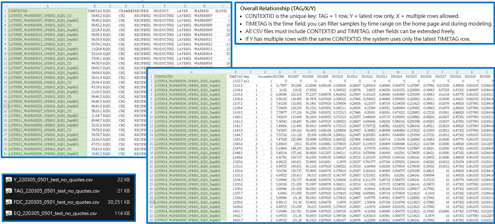
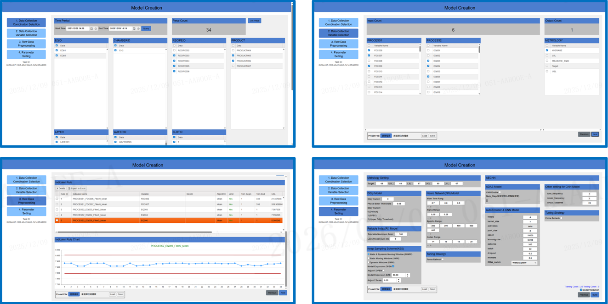
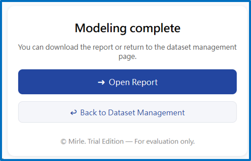
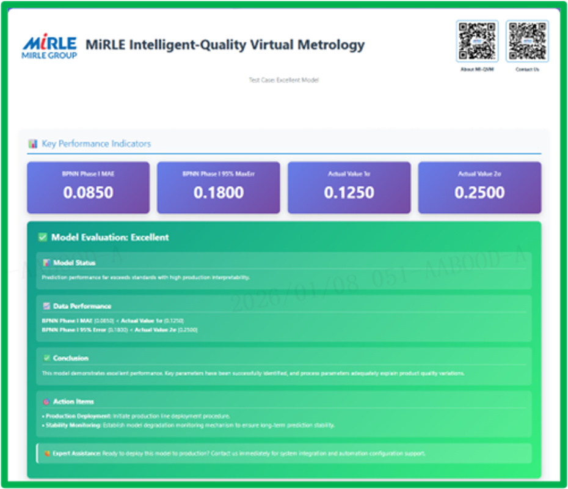

# MI-QVM Trial Version Operation Flow

* **Launch**
    * Obtain Image
    * Start QVM Trial Version

* **Operation**
    * Visit QVM Trial Version Page
    * Create Dataset
    * Operate MCC Modeling
    * Download Report
    * Open Report

## Launch

### Obtain Image



### Start QVM Trial Version

```bash
sudo docker load -i combined-backup.tar
sudo docker run -d --name combined-api -p 5500:5500 -p 9999:7878 combined-api-image:latest
```



## Operation

### Visit QVM Trial Version Page

Access the following URL:
http://127.0.0.1:9999/trial



### Create Dataset


  
### CSV Content Reference



### Operate MCC Modeling



### Download Report



### Open Report

